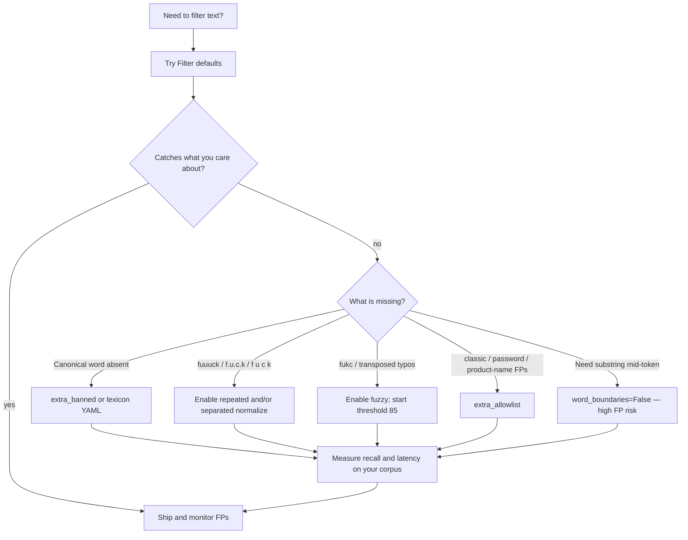

# Configuration guide

This guide helps you choose `FilterConfig` options for your product: what defaults cover, when to opt in, false-positive tradeoffs, and performance cost.

For pipeline internals see [How Profanex works](how_it_works.md). For measured numbers on one host see [benchmarks](benchmarks.md).

## TL;DR

| Goal | Start with |
| --- | --- |
| Comments / chat moderation, low FP | `Filter()` defaults |
| Stronger evasion (`fuuuck`, `f.u.c.k`, `f u c k`) | Add `normalize_repeated_chars` + `normalize_separated_runs` |
| Typos (`fukc`, `fcuk`) | Add `enable_fuzzy=True` (measure first) |
| Hide slurs only (or drop a category) | `categories=...` |
| Product-specific words / false friends | `extra_banned` / `extra_allowlist` |
| Maximum recall, accept more FP + CPU | Combine normalize opts + fuzzy; keep `word_boundaries=True` unless you know you need substring mode |

Defaults are intentional: **exact + leet + word boundaries**, fuzzy and aggressive normalize **off**.

```python
from profanex import Filter, FilterConfig

# Conservative (default)
f = Filter()

# Stricter evasion, still no fuzzy
strict = Filter(FilterConfig(
    normalize_repeated_chars=True,
    normalize_separated_runs=True,
))

# Evasion + typos (highest CPU / recall among common recipes)
strict_fuzzy = Filter(FilterConfig(
    normalize_repeated_chars=True,
    normalize_separated_runs=True,
    enable_fuzzy=True,
    threshold=85,
))
```

## Decision flow



## What defaults already cover

With `Filter()` you get:

| Covered | Examples |
| --- | --- |
| Exact single terms and phrases | `fuck`, `blow job` |
| Case / NFKC folding | `FUCK`, fullwidth letters |
| Default leet | `b1tch`, `a55`, `sh!t`; numeric-only tokens remain literal even beside non-Latin text |
| Packaged asterisk literals | `f*ck`, `f**k`, `sh*t`, `b*tch`, `s**t`, `d*ck`, … |
| Word-boundary + allowlist safety | `classic`, `password`, `assassin` (WB; packaged allowlist magnets) |
| Phrase separator folding | `blow   job`, `blow-job` |

You do **not** get (unless you opt in or add lexicon entries):

| Not covered by default | Enable / fix with |
| --- | --- |
| `fuuuck` | `normalize_repeated_chars=True` |
| `f.u.c.k`, `f*u*c*k`, `f_u_c_k`, `f u c k` | `normalize_separated_runs=True` |
| `fukc`, many single-edit typos | `enable_fuzzy=True` |
| `phuck`, heavy truncations (`fck`), Cyrillic lookalikes | Often still uncovered; treat as lexicon or out of scope |
| Mild words (`damn`, `hell`) | Policy exclusion — add via `extra_banned` if you want them |
| Bare `kill` / `murder` | High FP in normal prose — usually leave out |

## Option reference

### Lexicon and categories

| Option | Default | When to use | Watch out |
| --- | --- | --- | --- |
| `categories` | all | Drop `SLURS` or limit to `SEXUAL` / etc. for product policy | Custom mappings may assign a term to multiple categories |
| `banned` / `banned_path` | packaged | Fully replace the built-in list | Mutually exclusive with each other |
| `extra_banned` / `extra_banned_path` | none | Add product terms without forking the whole lexicon | Prefer this over replacing unless you maintain a full list |
| `allowlist` / `allowlist_path` | packaged | Replace false-positive shields | Mutually exclusive with each other |
| `extra_allowlist` / `extra_allowlist_path` | none | Brand names, codenames, domain jargon, exact overrides | Allowed terms take final precedence after normalization |

Packaged terms use `general` only when they do not belong to a more specific `sexual`, `excretory`, `slurs`, or `violence` category. This makes category exclusion predictable: a `general`-only policy does not retain terms from a disabled specific category. Custom category mappings may still intentionally assign one term to multiple categories, in which case it remains active if any assigned category is enabled. Flat custom banned lists normally use `general`; when `general` is disabled, they use the selected categories so custom terms are not silently discarded. Use a category mapping when exact match metadata matters.

**Performance:** lexicon size affects Aho-Corasick build time (once per `Filter()`) and match cost slightly. Dozens of `extra_*` terms are cheap; tens of thousands are still usually fine relative to fuzzy cost. Prefer curated extras over enabling fuzzy “to catch everything.”

### Word boundaries

| Option | Default | When to use | Watch out |
| --- | --- | --- | --- |
| `word_boundaries` | `True` | Almost always | `False` matches substrings (`ass` in `classic` unless allowlisted) |

Keep `True` for user-generated comments. Only disable for specialized substring scanning where you accept the FP rate and have a strong allowlist.

**Performance:** with defaults, clean texts skip UAX#29 boundary work until a banned AC hit appears. Fuzzy mode builds boundaries eagerly (tokenization needs them). Turning boundaries off avoids that work when fuzzy is also off.

### Leet and optional normalize

| Option | Default | Catches | When to enable | Cost / risk |
| --- | --- | --- | --- | --- |
| `normalize_leet` | `True` | `b1tch`, `a55`, `sh!t`, … | Leave on unless you need literal digits preserved | Requires an ASCII alphabetic anchor, avoiding numeric-only and cross-script false positives |
| `normalize_repeated_chars` | `False` | `fuuuck` → `fuck` (runs of length ≥ 3) | Chat / gaming evasion | Extra normalize pass; can collapse intentional stretch spelling in non-profane words if those fold into banned forms |
| `normalize_separated_runs` | `False` | `f.u.c.k`, `f*u*c*k`, `f_u_c_k`, `f u c k` | Same | Extra pass; joins only singleton letter runs with left/right guards so `say f u c k now` → `say fuck now` |

Enable **both** normalize flags together when moderation is adversarial. Leave them off for corporate docs / low-evasion corpora to save work and reduce odd folds.

**Performance (order of magnitude on clean text):**

- Defaults: fastest path (~1–3 µs `contains` on short ASCII in local release benches).
- Either normalize opt-in: roughly **+50–80%** on clean-path normalize (still far cheaper than cold fuzzy).
- Does not change the “skip allow/boundaries on zero AC hits” structure of the default scan.

### Fuzzy matching

| Option | Default | Meaning |
| --- | --- | --- |
| `enable_fuzzy` | `False` | Compare unmatched tokens to length-bucketed lexicon terms |
| `threshold` | `85` | Minimum indel similarity score (0–100) |
| `min_fuzzy_len` | `4` | Skip short tokens/terms |
| `fuzzy_length_delta` | `2` | Only compare populated term buckets within ±δ length; maximum 64 |
| `fuzzy_max_token_len` | `64` | CPU bound on huge tokens; maximum 256 |

**When to enable:** user text with frequent typos and you already accept normalize opt-ins or exact-only gaps.

**When to keep off:** high-QPS clean-heavy traffic; compliance surfaces where false positives are costly; until you have a golden set.

**Behavior notes:**

- Fuzzy is single-token only (not phrases).
- `contains` returns as soon as any exact/phrase hit exists — it does not run fuzzy “for completeness.”
- Score is indel similarity; lower `threshold` ⇒ more recall and more FP/CPU.
- Start at `85`; try `75` only with measurement on your FP corpus.
- Unique-token floods (usernames, IDs) stress the fuzzy cache; prefer keeping fuzzy off on that traffic shape.

**Performance:**

| Path | Relative cost |
| --- | --- |
| Exact clean `contains` | Baseline |
| Fuzzy warm cache (repeated tokens) | Similar order to exact |
| Fuzzy cold / diverse tokens | Often **10–100×** exact on miss-heavy text |
| Batch `contains_many` with fuzzy | Scales with workers; still measure p99 |

Treat fuzzy as **attacker-influenced CPU**: users can craft text that forces more comparisons. Cap exposure with `min_fuzzy_len`, `fuzzy_max_token_len`, and a high threshold.

### Masking

| Option | Default | When to use |
| --- | --- | --- |
| `mask="stars"` | yes | Redact whole match spans |
| `mask="vowels"` | | Keep consonants; ASCII `a/e/i/o/u` only |
| custom callable | | Product-specific redaction |

Custom masks run in **Python**, **serially**, and cannot use `parallel=True` on `clean_many`. Prefer built-in masks for throughput.

## Recipes

### 1. Public comments (recommended default)

```python
Filter()
```

Exact + leet, low FP, best latency. Add `extra_allowlist` for brand names as they appear.

### 2. Gaming / chat with obfuscation

```python
Filter(FilterConfig(
    normalize_repeated_chars=True,
    normalize_separated_runs=True,
))
```

Catches stretched and separated spellings without paying fuzzy’s worst-case cost.

### 3. Obfuscation + typos

```python
Filter(FilterConfig(
    normalize_repeated_chars=True,
    normalize_separated_runs=True,
    enable_fuzzy=True,
    threshold=85,
))
```

Validate on a held-out FP set (`fixtures/corpora/fp.yaml` is a starting point). Watch p99 under load.

### 4. Category policy

```python
from profanex import Category, Filter, FilterConfig

Filter(FilterConfig(
    categories=frozenset(c for c in Category if c != Category.SLURS),
))
```

### 5. Replace vs extend lexicon

```python
# Extend (usual)
Filter(FilterConfig(extra_banned=["competitorcodename"], extra_allowlist=["ourbrand"]))

# Replace (you own the full list)
Filter(FilterConfig(banned_path="policies/banned.yaml", allowlist_path="policies/allow.yaml"))
```

## Batch and parallelism

| API | Use when |
| --- | --- |
| `contains` / `find` / `clean` | Single texts needing one result |
| `analyze` / `analyze_many` | Detection flag and cleaned text from one scan |
| `*_many(..., parallel=False)` | Small batches; lowest overhead |
| `*_many(..., parallel=True, workers=N)` | Large batches (≥ ~200 texts on typical hosts); set `workers` from 1–256 if the app already uses threads |
| `iter_*` | Streaming / bounded memory |

Parallelism helps **CPU-bound** matching. It does not fix a too-low fuzzy threshold. See [parallel crossover](benchmarks.md#parallel-batch-crossover).

## Performance cheat sheet

Relative to default exact matching on short clean ASCII (local release builds; your host will differ):

| Config change | Typical effect |
| --- | --- |
| Defaults | Fastest; clean path avoids boundary/allow work until a banned hit |
| + repeated / separated normalize | Moderate normalize cost; enable only if needed |
| + fuzzy, repeated tokens | Often acceptable after cache warm |
| + fuzzy, unique tokens / long texts | Large latency and p99 risk |
| + `word_boundaries=False` | Slightly less boundary work; much higher FP |
| Larger lexicon | Small match cost; pay at `Filter()` compile time |
| Custom Python mask | Dominates `clean` cost; no parallel clean |

**Guidance:** optimize recall with lexicon and normalize flags first; add fuzzy last and measure `contains` / `contains_many` p50 and p99 on production-shaped traffic (mostly clean).

## Invariants to rely on

```python
assert f.contains(text) == bool(f.find(text))
# Built-in clean masks exactly the find spans
```

`FilterConfig` and `Filter` are immutable after construction. Build once, reuse across requests.

## Validating your policy

1. Run defaults against a sample of real traffic; log misses you care about.
2. Classify misses: missing lexicon term vs needs normalize vs needs fuzzy vs out of scope.
3. Prefer `extra_banned` / asterisk literals for recurring exact forms.
4. Enable normalize flags for structural evasion.
5. Enable fuzzy only with an FP regression set and a latency budget.
6. Re-check allowlist magnets (`classic`, `password`, product names) and WB settings.

Fixture suites under [`fixtures/`](https://github.com/jyablonski/profanex/blob/main/fixtures/README.md) and `uv run python scripts/report_defaults_gaps.py` help inventory default gaps. For synthetic evasion sweeps: `uv run python scripts/evaluate_variation_gaps.py`.

## Related docs

- [README — quick config table](https://github.com/jyablonski/profanex#configuration)
- [How it works](how_it_works.md)
- [Benchmarks](benchmarks.md)
- [Lexicon provenance](https://github.com/jyablonski/profanex/blob/main/profanex/data/PROVENANCE.md)
- [Release checklist](release-checklist.md)
