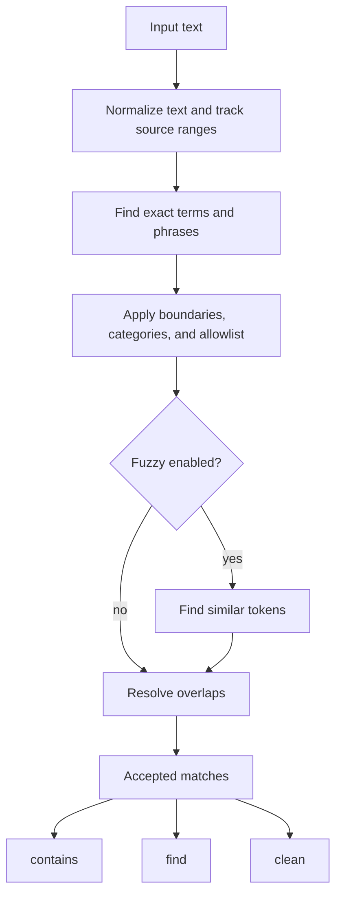

# How Profanex works

Profanex separates policy from matching:

- Python validates configuration, loads YAML, and exposes the public API.
- Rust normalizes text, finds matches, resolves overlaps, masks text, and processes batches.

Rust keeps the matching path fast and makes Unicode span handling easier to test. The pure Rust engine lives in `crates/profanex-core`; `src/lib.rs` exposes it privately as `profanex._core`.

## Matching pipeline



`contains`, `find`, and `clean` apply the same acceptance policy:

```python
assert filter.contains(text) == bool(filter.find(text))
```

Built-in cleaning masks exactly the spans returned by `find`.

## Configuration and lexicons

`FilterConfig` is immutable and validates its in-memory values eagerly; YAML contents are validated while constructing the immutable `Filter`. Lexicon sources are applied in this order:

1. Use a replacement lexicon or the packaged default.
2. Remove terms from disabled categories.
3. Add extra banned and allowed terms.
4. Give normalized allowlist entries final precedence during matching.

Packaged YAML is loaded with `importlib.resources`, so `Filter()` works from any current working directory. User YAML is parsed with `yaml.safe_load` and limited to 10 MiB per file.

## Normalization and spans

Default normalization applies:

- Unicode NFKC across complete grapheme clusters
- Unicode full case folding followed by NFKC stabilization
- A small leetspeak map (`0→o`, `1→i`, infix `!→i`, `3→e`, `4`/`@→a`, `5`/`$→s`, `7→t`, `8→b`)
- Canonical separators for phrases

Asterisk masks such as `f*ck` are not folded by leet (no single safe letter). Common forms are listed explicitly in the packaged lexicon. Trailing `!` is left alone so `Fuck!` still matches `fuck`.

Optional normalization can collapse repeated letters (`fuuuck`) or separated character runs (`f.u.c.k`, `f u c k`). Both options are disabled by default because they expand the set of matching inputs. Enable them together when you need stronger evasion coverage:

```python
Filter(FilterConfig(
    normalize_repeated_chars=True,
    normalize_separated_runs=True,
))
```

Rust tracks the original UTF-8 range for every normalized character. The Python binding converts accepted byte ranges to half-open Python string indexes:

```python
match.text == text[match.start:match.end]
```

## Exact and phrase matching

Normalized banned terms compile into an Aho-Corasick automaton. Candidates are filtered by Unicode word boundaries and allowlist coverage.

Matches are ordered and non-overlapping. Resolution prefers:

1. Exact or phrase matches over fuzzy matches
2. Earlier starts
3. Longer spans
4. Higher scores
5. Stable lexicon order

## Fuzzy matching

Fuzzy matching is disabled by default and applies only to individual tokens that did not match exactly.

The score is indel similarity over normalized Unicode scalar values:

```text
score = 100 × (1 - indel_distance(a, b) / (len(a) + len(b)))
```

The engine limits fuzzy work by:

- Ignoring tokens and terms shorter than `min_fuzzy_len` (default 4)
- Ignoring tokens longer than `fuzzy_max_token_len` (default 64)
- Comparing only populated term-length buckets within `fuzzy_length_delta` characters (default 2, maximum 64)
- Skipping equal-length buckets when the threshold only allows distance 0 (those hits are already exact)
- Stopping comparisons that cannot reach `threshold`
- Memoizing best-match results in a bounded, sharded clock cache that continues admitting new tokens
- Skipping the fuzzy pass entirely for `contains` when an exact/phrase hit already exists
- Returning from fuzzy `contains` as soon as one accepted candidate is found

Fuzzy matching is attacker-influenced CPU work. Measure it separately from exact matching and keep it disabled unless the additional recall is needed. See the [configuration guide](configuration.md) for when to enable it.

## Masking and batches

Built-in `"stars"` and `"vowels"` masks run in Rust. The `"vowels"` mask replaces ASCII `a/e/i/o/u` (case-insensitive) only; non-ASCII letters such as `ü` are left unchanged. A custom Python mask receives the source text and accepted matches, runs serially, and cannot be combined with parallel `clean_many`.

The `*_many` methods accept sequences and preserve order. The `iter_*` methods process any iterable in bounded chunks. `analyze` and `analyze_many` return detection flags and cleaned text from one resolved scan. `parallel=True` uses Rayon while the Python GIL is released; explicit `workers` values are capped at 256, and the engine retains only the most recently requested custom pool to bound thread resources.

## Errors and privacy

- Invalid policy, YAML, thresholds, and worker counts raise Python exceptions.
- Normal input errors do not panic across the Rust/Python boundary.
- Profanex does not log input text or matched tokens by default.
- The library performs no network requests.

## Related documentation

- [Public usage](https://github.com/jyablonski/profanex#readme)
- [Configuration guide](configuration.md)
- [Benchmarks](benchmarks.md)
- [Fixture schema](https://github.com/jyablonski/profanex/blob/main/fixtures/README.md)
- [Lexicon provenance](https://github.com/jyablonski/profanex/blob/main/profanex/data/PROVENANCE.md)
- [Contributor guide](https://github.com/jyablonski/profanex/blob/main/CONTRIBUTING.md)
